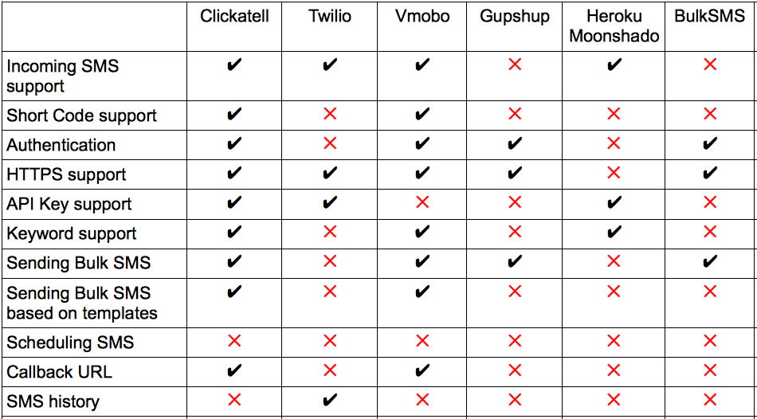
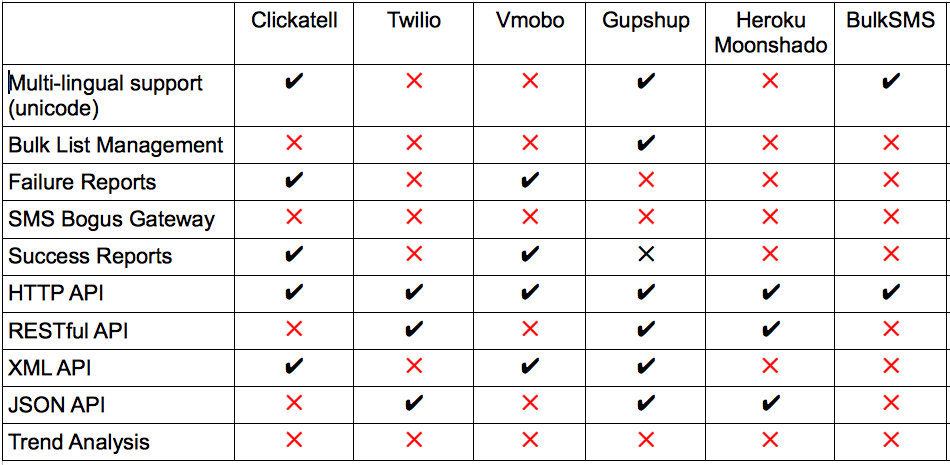

!SLIDE center

# So how does one start ?

## Choose a vendor?

!SLIDE center transition=fade

# So how does one start ?

## Choose a vendor? 

!SLIDE  center transition=fade

# So how does one start ?

## Choose a vendor! 

!SLIDE  center transition=fade

# So how does one start ?

## Choose a vendor! 

!SLIDE  center transition=fade

# So how does one start ?

## Choose a vendor! 

!SLIDE  center transition=fade

# So how does one start ?

## Choose a vendor! 

!SLIDE center

# AND don't forget..

!SLIDE center

# The different protocols..

!SLIDE center transition=fade

# The different protocols..

<h1>HTTP</h1>
<h1>REST</h1>
<h1>XML</h1>
<h1>WSDL</h1>
<h1>SOAP</h1>

!SLIDE bullets

# Hmm.. Choices! Choices!

* Choose the cheapest?
* Choose the costliest ;)
* Resolve issues later!

!SLIDE bullets incremental

# But.. the nagging doubts linger!

* Did I choose the right vendor?
* Can I afford to change the vendor?
* Have I shot myself in the foot?

!SLIDE bullets 

# But.. the nagging doubts linger!

* Did I choose the right vendor?
* Can I afford to change the vendor?
* Have I shot myself in the foot?
* Argh! Its too late!

!SLIDE bullets incremental

# The Solution?

* Hire some unwitting developer!
* Outsource to India? ;)

!SLIDE center

# The problem still persists!
## Vendors have different APIs

!SLIDE 

## Customized bulk messages - Clickatell

    @@@ruby
    url = "http://api.clickatell.com"

    response = Net::HTTP.get URI.parse(
      "#{url}/http/auth?api_id...")
    # check for success
    session_id = response[0]

    str ="Hi #field1#, hold on to your #field2#"
    response = Net::HTTP.get URI.parse(
      "#{url}/http_batch/startbatch?session_id=..")
    # check for success
    batch_id = response[0]

!SLIDE

## Customized bulk messages - Clickatell

    @@@ruby
    numbers.each do |number|
      # prepare fields for the number!

      response = Net::HTTP.get URI.parse(
       "#{url}/http_batch/senditem?sess..." +
       "&to=#{number}&field1=#{something}...")

      # check for success
      status = response[0]
    end

    # End batch /http_batch/endbatch

!SLIDE

## Customized bulk messages - vMobo

    @@@xml
    <request>
      <message><![CDATA[ Hi <%= name %>,
              hold on to your <%= item %>.]]>
      </message>
      <recipients>
        <recipient>
            <phone_number>9876511111</phone_number>
            <attributes>
                <name>John</name>
                <item>coffee</item>
            </attributes>
        </recipient>
        ...
      </recipients>
    </request>

!SLIDE 

# The SPlat way

    @@@ruby

    clickatell = Splat::Base.new(:clickatell)

    custom_msg = "Hi $1, hold on to your $2."
    options = {
      '+91 9960054954' => ['John', 'coffee'],
      '+91 9881395656' => ['Jane' , 'stocks']
    }

    clickatell.send_bulk_sms_with_insertion(
                  custom_msg, options)

!SLIDE 

# And the API mess continues..

!SLIDE  center transition=fade
# Vendor Analysis Matrix

!SLIDE center transition=fade

# Vendor Analysis Matrix

!SLIDE center

# I love SPlat
